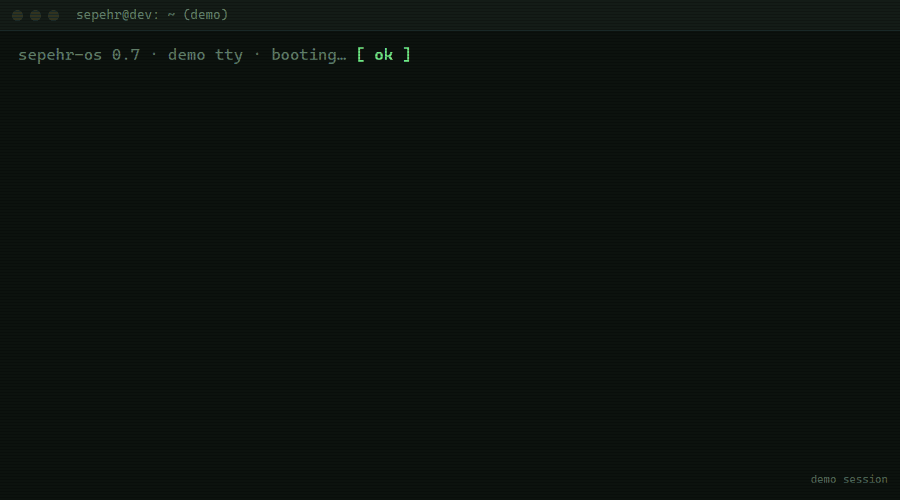
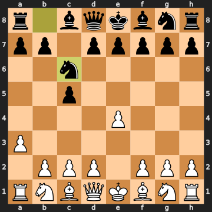

  

  <b>I build AI that talks, acts and gets checked, most of it Persian-first.</b> 
  Realtime voice agents · approval-gated MCP agents · LLM-as-judge evals · grounded LLM apps

سلام! من سپهرم. دستیارهای هوشمند فارسی می&zwnj;سازم، از صدا تا ابزار.

  
  
  
  
  
  
  
  
  
  
  
  

<!-- TERMINAL:START -->

  

<!-- TERMINAL:END -->

---

## What I build

- **Voice, in real time.** Speech-to-speech agents on LiveKit and OpenAI Realtime, plus a Persian phone receptionist on a real Asterisk line.
- **Agents with a human in the loop.** MCP and native tool calling, default-deny tool policies, hard step and dollar caps. Reads run, writes wait for a click.
- **Evals, not vibes.** LLM-as-judge scoring, generated test suites for voice agents, human expert scoring side by side.
- **The model drafts, code does the math.** Structured outputs, deterministic parsers, every value traced back to its source.
- **Persian-first.** RTL interfaces, Farsi speech in and out, turn-taking tuned for Farsi pauses.

<b>Capabilities, and the repos that prove them</b>

 

| Capability | Proof |
|---|---|
| Realtime voice agents (LiveKit, speech-to-speech) | [livekit-fa-agent](https://github.com/sepehr071/livekit-fa-agent) · [voice-chess-coach](https://github.com/sepehr071/voice-chess-coach) · [product-assistant](https://github.com/sepehr071/product-assistant) |
| Telephony voice AI (Asterisk, Android dialer) | [phone-agent](https://github.com/sepehr071/phone-agent) |
| Tool-calling / MCP agents (approval gates in pm-assistant, pr-agent, dongeto) | [pm-assistant](https://github.com/sepehr071/pm-assistant) · [agent-studio](https://github.com/sepehr071/agent-studio) · [pr-agent](https://github.com/sepehr071/pr-agent) · [dongeto](https://github.com/sepehr071/dongeto) |
| Coding agents | [sepicode](https://github.com/sepehr071/sepicode) · [pr-agent](https://github.com/sepehr071/pr-agent) |
| LLM evals (LLM-as-judge, test generation, human scoring) | [voice-agent-testgen](https://github.com/sepehr071/voice-agent-testgen) · [rag-evaluator](https://github.com/sepehr071/rag-evaluator) · [polymind](https://github.com/sepehr071/polymind) |
| RAG and grounded answers | [livekit-fa-agent](https://github.com/sepehr071/livekit-fa-agent) · [product-assistant](https://github.com/sepehr071/product-assistant) · [steel-market-analyst](https://github.com/sepehr071/steel-market-analyst) |
| Structured output and document AI (OCR, diarization, vision) | [invoice-extractor](https://github.com/sepehr071/invoice-extractor) · [meeting-assistant](https://github.com/sepehr071/meeting-assistant) · [feedo](https://github.com/sepehr071/feedo) · [ai-explain](https://github.com/sepehr071/ai-explain) |
| Text-to-SQL with guardrails | [erp-sql-agent](https://github.com/sepehr071/erp-sql-agent) |
| AI safety (DLP, sandboxing, prompt-injection guards, step and spend caps) | [polymind](https://github.com/sepehr071/polymind) · [invoice-extractor](https://github.com/sepehr071/invoice-extractor) · [ai-explain](https://github.com/sepehr071/ai-explain) · [sepicode](https://github.com/sepehr071/sepicode) |

---

## Featured projects

<table>
<tr>
<td width="50%" valign="top">

<h3><a href="https://github.com/sepehr071/livekit-fa-agent">Rahnama · livekit-fa-agent</a></h3>
A Persian voice agent that talks back in real time and answers only from retrieved passages, built to work on filtered networks.
  
RAG via a <code>search_knowledge</code> tool call · turn-taking tuned for Farsi pauses · UDP → ICE/TCP fallback 
<b>Python · LiveKit Agents · OpenAI Realtime · nginx</b>
</td>
<td width="50%" valign="top">

<h3><a href="https://github.com/sepehr071/voice-chess-coach">Chess Live · voice-chess-coach</a></h3>
Talk to a chess coach, play White by voice, and watch it answer as Black on a live board, in Persian or English.
  
The voice model can't fake a move: <code>tool_choice="required"</code> + python-chess owns the rules · board sync over LiveKit RPC 
<b>React 19 · TypeScript · LiveKit · Python</b>
</td>
</tr>
<tr>
<td width="50%" valign="top">

<h3><a href="https://github.com/sepehr071/pm-assistant">PM Assistant · pm-assistant</a></h3>
A local-first AI copilot for project managers: reads and acts across Jira, GitHub, Slack and more, and every write waits for your click.
  
Default-deny tool policy · approve/reject mid-stream (browser or Telegram) · plain-English rules compiled once, polled with zero LLM calls 
<b>Python · FastAPI · React 19 · SQLite · MCP</b>
</td>
<td width="50%" valign="top">

<h3><a href="https://github.com/sepehr071/sepicode">sepicode</a></h3>
A full-screen terminal coding agent that reads, edits, searches and runs your code, with hard step and dollar caps on every turn.
  
Streaming Markdown, live tool-call timeline, inline diffs · nine zod-typed tools · read-only sub-agent capped at 8 steps / $0.25 
<b>Bun · TypeScript · React · OpenTUI · OpenRouter</b>
</td>
</tr>
<tr>
<td width="50%" valign="top">

<h3><a href="https://github.com/sepehr071/meeting-assistant">Meeting Assistant · meeting-assistant</a></h3>
Drop in a Persian meeting recording; get back who said what, the decisions, the action items and a follow-up email.
  
Parallel chunked transcription with speaker stitching across seams · minutes from diarized words, summaries via strict JSON schema 
<b>Python · FastAPI · Next.js · ElevenLabs Scribe v2</b>
</td>
<td width="50%" valign="top">

<h3><a href="https://github.com/sepehr071/polymind">Polymind · polymind</a></h3>
A self-hosted, multi-model AI workspace with a DLP gate, sandboxed code execution and first-class Persian (RTL) support.
  
Side-by-side arena + judged debates between 2-5 models · DLP scan before any provider · LLM-written pandas runs under bubblewrap, no network 
<b>Python · FastAPI · PostgreSQL · React · OpenRouter</b>
</td>
</tr>
</table>

---

## ♟️ Play chess against my AI coach

Click a move and open the issue: Stockfish answers as Black, and an LLM coach comments in English and Persian, a taste of my [voice-chess-coach](https://github.com/sepehr071/voice-chess-coach).

<!-- CHESS:START -->
<h3 align="center">Chess vs. the AI Coach</h3>

Game #1 &middot; you play <b>White</b>: click a move below, Stockfish answers as Black and an LLM coach comments.

<b>White to move</b> &middot; last: a3 / Nc6 by <a href="https://github.com/sepehr071">@sepehr071</a>

<i>Coach:</i> Solid play - keep developing pieces and fight for the center.

بازی محکمی است؛ مهره‌ها را توسعه بده و برای مرکز بجنگ.

<b>Your move</b> (legal moves for White)

| Piece | Moves |
| :-- | :-- |
| King | [Ke2](https://github.com/sepehr071/sepehr071/issues/new?title=chess%3A+move+e1e2&body=Just+press+Submit+%E2%80%94+the+bot+plays+Black+within+a+minute.) |
| Queen | [Qe2](https://github.com/sepehr071/sepehr071/issues/new?title=chess%3A+move+d1e2&body=Just+press+Submit+%E2%80%94+the+bot+plays+Black+within+a+minute.) &middot; [Qf3](https://github.com/sepehr071/sepehr071/issues/new?title=chess%3A+move+d1f3&body=Just+press+Submit+%E2%80%94+the+bot+plays+Black+within+a+minute.) &middot; [Qg4](https://github.com/sepehr071/sepehr071/issues/new?title=chess%3A+move+d1g4&body=Just+press+Submit+%E2%80%94+the+bot+plays+Black+within+a+minute.) &middot; [Qh5](https://github.com/sepehr071/sepehr071/issues/new?title=chess%3A+move+d1h5&body=Just+press+Submit+%E2%80%94+the+bot+plays+Black+within+a+minute.) |
| Rook | [Ra2](https://github.com/sepehr071/sepehr071/issues/new?title=chess%3A+move+a1a2&body=Just+press+Submit+%E2%80%94+the+bot+plays+Black+within+a+minute.) |
| Bishop | [Ba6](https://github.com/sepehr071/sepehr071/issues/new?title=chess%3A+move+f1a6&body=Just+press+Submit+%E2%80%94+the+bot+plays+Black+within+a+minute.) &middot; [Bb5](https://github.com/sepehr071/sepehr071/issues/new?title=chess%3A+move+f1b5&body=Just+press+Submit+%E2%80%94+the+bot+plays+Black+within+a+minute.) &middot; [Bc4](https://github.com/sepehr071/sepehr071/issues/new?title=chess%3A+move+f1c4&body=Just+press+Submit+%E2%80%94+the+bot+plays+Black+within+a+minute.) &middot; [Bd3](https://github.com/sepehr071/sepehr071/issues/new?title=chess%3A+move+f1d3&body=Just+press+Submit+%E2%80%94+the+bot+plays+Black+within+a+minute.) &middot; [Be2](https://github.com/sepehr071/sepehr071/issues/new?title=chess%3A+move+f1e2&body=Just+press+Submit+%E2%80%94+the+bot+plays+Black+within+a+minute.) |
| Knight | [Nc3](https://github.com/sepehr071/sepehr071/issues/new?title=chess%3A+move+b1c3&body=Just+press+Submit+%E2%80%94+the+bot+plays+Black+within+a+minute.) &middot; [Ne2](https://github.com/sepehr071/sepehr071/issues/new?title=chess%3A+move+g1e2&body=Just+press+Submit+%E2%80%94+the+bot+plays+Black+within+a+minute.) &middot; [Nf3](https://github.com/sepehr071/sepehr071/issues/new?title=chess%3A+move+g1f3&body=Just+press+Submit+%E2%80%94+the+bot+plays+Black+within+a+minute.) &middot; [Nh3](https://github.com/sepehr071/sepehr071/issues/new?title=chess%3A+move+g1h3&body=Just+press+Submit+%E2%80%94+the+bot+plays+Black+within+a+minute.) |
| Pawn | [a4](https://github.com/sepehr071/sepehr071/issues/new?title=chess%3A+move+a3a4&body=Just+press+Submit+%E2%80%94+the+bot+plays+Black+within+a+minute.) &middot; [b3](https://github.com/sepehr071/sepehr071/issues/new?title=chess%3A+move+b2b3&body=Just+press+Submit+%E2%80%94+the+bot+plays+Black+within+a+minute.) &middot; [b4](https://github.com/sepehr071/sepehr071/issues/new?title=chess%3A+move+b2b4&body=Just+press+Submit+%E2%80%94+the+bot+plays+Black+within+a+minute.) &middot; [c3](https://github.com/sepehr071/sepehr071/issues/new?title=chess%3A+move+c2c3&body=Just+press+Submit+%E2%80%94+the+bot+plays+Black+within+a+minute.) &middot; [c4](https://github.com/sepehr071/sepehr071/issues/new?title=chess%3A+move+c2c4&body=Just+press+Submit+%E2%80%94+the+bot+plays+Black+within+a+minute.) &middot; [d3](https://github.com/sepehr071/sepehr071/issues/new?title=chess%3A+move+d2d3&body=Just+press+Submit+%E2%80%94+the+bot+plays+Black+within+a+minute.) &middot; [d4](https://github.com/sepehr071/sepehr071/issues/new?title=chess%3A+move+d2d4&body=Just+press+Submit+%E2%80%94+the+bot+plays+Black+within+a+minute.) &middot; [e5](https://github.com/sepehr071/sepehr071/issues/new?title=chess%3A+move+e4e5&body=Just+press+Submit+%E2%80%94+the+bot+plays+Black+within+a+minute.) &middot; [f3](https://github.com/sepehr071/sepehr071/issues/new?title=chess%3A+move+f2f3&body=Just+press+Submit+%E2%80%94+the+bot+plays+Black+within+a+minute.) &middot; [f4](https://github.com/sepehr071/sepehr071/issues/new?title=chess%3A+move+f2f4&body=Just+press+Submit+%E2%80%94+the+bot+plays+Black+within+a+minute.) &middot; [g3](https://github.com/sepehr071/sepehr071/issues/new?title=chess%3A+move+g2g3&body=Just+press+Submit+%E2%80%94+the+bot+plays+Black+within+a+minute.) &middot; [g4](https://github.com/sepehr071/sepehr071/issues/new?title=chess%3A+move+g2g4&body=Just+press+Submit+%E2%80%94+the+bot+plays+Black+within+a+minute.) &middot; [h3](https://github.com/sepehr071/sepehr071/issues/new?title=chess%3A+move+h2h3&body=Just+press+Submit+%E2%80%94+the+bot+plays+Black+within+a+minute.) &middot; [h4](https://github.com/sepehr071/sepehr071/issues/new?title=chess%3A+move+h2h4&body=Just+press+Submit+%E2%80%94+the+bot+plays+Black+within+a+minute.) |

**Last moves**

| # | Player | White | Black |
| --: | :-- | :-- | :-- |
| 2 | [@sepehr071](https://github.com/sepehr071) | a3 | Nc6 |
| 1 | [@sepehr071](https://github.com/sepehr071) | e4 | c5 |

**Top players**

| Player | Moves |
| :-- | --: |
| [@sepehr071](https://github.com/sepehr071) | 2 |

<!-- CHESS:END -->

---

## More projects

<table>
<tr>
<td width="33%" valign="top">
 
<b><a href="https://github.com/sepehr071/product-assistant">product-assistant</a></b> 
Scan a product, ask it out loud about sugar or allergens. Realtime voice grounded in pack facts.
</td>
<td width="33%" valign="top">
 
<b><a href="https://github.com/sepehr071/phone-agent">phone-agent</a></b> 
Persian AI phone receptionist on a real line: Asterisk AudioSocket, 8 kHz PCM, plus an Android dialer app.
</td>
<td width="33%" valign="top">
 
<b><a href="https://github.com/sepehr071/voice-agent-testgen">voice-agent-testgen</a></b> 
Paste a voice agent's prompt, get a judged test suite back. Runs the real agent via LiveKit's <code>AgentSession</code>.
</td>
</tr>
<tr>
<td width="33%" valign="top">
 
<b><a href="https://github.com/sepehr071/agent-studio">agent-studio</a></b> 
Persian-first AI workbench: native tools and MCP servers (stdio, HTTP, SSE), every step visible in the chat.
</td>
<td width="33%" valign="top">
 
<b><a href="https://github.com/sepehr071/pr-agent">pr-agent</a></b> 
Seven AI reviewers on every GitLab merge request, one human who decides what gets posted.
</td>
<td width="33%" valign="top">
 
<b><a href="https://github.com/sepehr071/erp-sql-agent">erp-sql-agent</a></b> 
Ask your ledger in Persian, get audited numbers. SELECT-only SQL tool with a forced <code>LIMIT</code>.
</td>
</tr>
<tr>
<td width="33%" valign="top">
 
<b><a href="https://github.com/sepehr071/rag-evaluator">rag-evaluator</a></b> 
LLM-as-judge on four criteria, plus human experts scoring the same answers with AI scores hidden.
</td>
<td width="33%" valign="top">
 
<b><a href="https://github.com/sepehr071/steel-market-analyst">steel-market-analyst</a></b> 
Price PDFs in, grounded market read out. 13 named hallucination failure modes in the prompt pack.
</td>
<td width="33%" valign="top">
 
<b><a href="https://github.com/sepehr071/invoice-extractor">invoice-extractor</a></b> 
OCR + LLM extraction, every value linked to its box on the page. Injection-guarded, runs fully local.
</td>
</tr>
<tr>
<td width="33%" valign="top">
 
<b><a href="https://github.com/sepehr071/dongeto">dongeto · دنگتو</a></b> 
Type the expense in Farsi. The LLM drafts it, unit-tested code does the money math.
</td>
<td width="33%" valign="top">
 
<b><a href="https://github.com/sepehr071/feedo">feedo</a></b> 
Plain-Persian bug reports plus screenshots in, structured drafts out. The model never picks IDs.
</td>
<td width="33%" valign="top">
 
<b><a href="https://github.com/sepehr071/ai-explain">ai-explain</a></b> 
Ask anything, get an interactive HTML/SVG explainer, planned and streamed into a sandboxed iframe.
</td>
</tr>
</table>

<b>Off the clock: True Anomaly, a WebGPU space sim</b>

 

 
Fly a 6DOF probe through a real-scale solar system in the browser, every planet placed from NASA/JPL Horizons data. Physics in true kilometres with a Newton-iteration Kepler solver, rendered on Three.js <code>WebGPURenderer</code> with a WebGL fallback.

All screenshots use demo or synthetic data. Open any repo for architecture notes, setup and more screenshots.

### 🕹️ Commit arcade

<!-- ARCADE:START -->
<picture>
  <source media="(prefers-color-scheme: dark)" srcset="https://raw.githubusercontent.com/sepehr071/sepehr071/output/breakout-contribution-graph-dark.svg">
  <source media="(prefers-color-scheme: light)" srcset="https://raw.githubusercontent.com/sepehr071/sepehr071/output/breakout-contribution-graph.svg">
  
</picture>

My last year of commits as Breakout bricks, regenerated daily. <a href="https://abozanona.github.io/pacman-contribution-graph/">Play it yourself</a> · made with <a href="https://github.com/abozanona/pacman-contribution-graph">pacman-contribution-graph</a>

<!-- ARCADE:END -->

  

